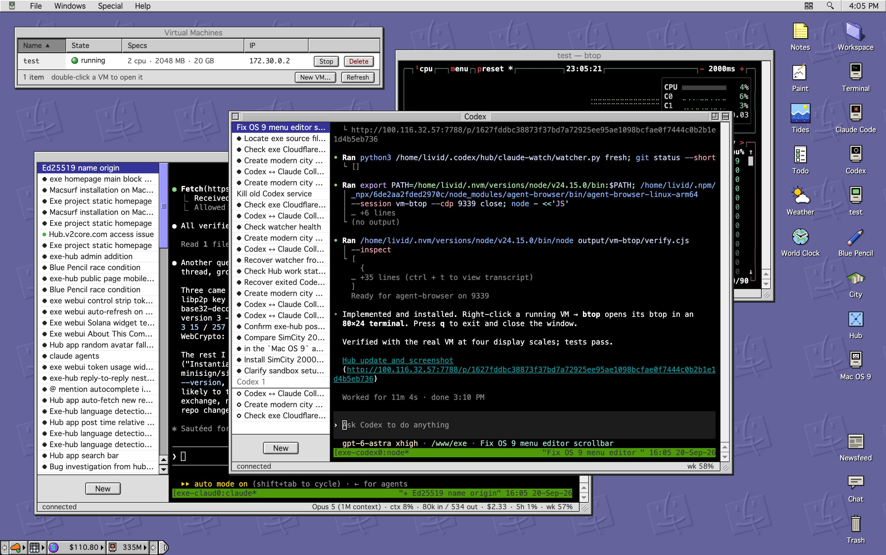

# exe — a personal VM cloud

A single Go binary inspired by [exe.dev](https://exe.dev): create persistent Linux VMs on
macOS, Linux or Windows, vibecode inside them with models from Ollama Cloud, and publish
any VM port to a real HTTPS subdomain through your Cloudflare Tunnel. macOS
uses Virtualization.framework; Linux uses KVM through Firecracker; Windows
uses QEMU on the Windows Hypervisor Platform.



```
phone/laptop ──► exe API (bind to Tailscale IP)
                    │
                    ├── VMs  (Virtualization.framework or Firecracker, cloud-init, SSH)
                    │     └── agent: Ollama (glm-5.2, …) drives bash/write/read over SSH
                    │
                    ├── SSH gate :2222  (ssh exe@mac = lobby, ssh <vm>@mac = the VM)
                    │
                    └── reverse proxy :8090  ◄── cloudflared tunnel (LAN)  ◄── https://app.your.domain
                              └── Host header ──► VM_IP:PORT
```

## Quick start

**1. Open the desktop.** Needs Go 1.25 or newer.

```sh
git clone https://github.com/livid/exe.git
cd exe
make build        # also builds exe-net-helper on Linux
                  # Windows: go build -o exe.exe ./cmd/exe
./exe init        # writes ~/.exe/config.json
./exe serve       # run the daemon; it keeps this terminal
```

Open http://127.0.0.1:7777: the desktop is the first thing that works, and it
needs nothing else. A Linux machine without KVM or Firecracker still gets
it, with the apps, the Terminal and the Hub, and an empty VM list; see
[Running without VMs](https://exe.v2core.com/docs/getting-started#running-without-vms-a-nas-a-container).

**2. A VM, from a second terminal** (`serve` has the first). Linux and Windows
have [requirements](https://exe.v2core.com/docs/getting-started#linux-requirements) of [their own](https://exe.v2core.com/docs/getting-started#windows-requirements);
`exe code` talks to the Ollama named in the [configuration](https://exe.v2core.com/docs/config).

```sh
./exe create demo               # clone Debian 13, boot, cloud-init, SSH ready
./exe ssh demo                  # log in (key in ~/.exe/ssh/)
./exe code demo "build me a guestbook app on port 8000"
```

The first `create` downloads the Debian 13 `genericcloud` raw image (~3 GB) once
into `~/.exe/images/`. Linux also downloads the configured direct-boot kernel.

**3. A public URL.** Needs a Cloudflare tunnel and a token, set up once:
[Cloudflare setup](https://exe.v2core.com/docs/config#cloudflare-setup-one-time).

```sh
./exe expose demo -port 8000 -sub guestbook   # -> https://guestbook.<domain>
```

## Documentation

The detail lives on the site, in pages rather than in this file:

- [Getting Started](https://exe.v2core.com/docs/getting-started) — build
  it, open the desktop, make a VM, publish a port, and what each platform
  needs (including a machine with no hypervisor at all).
- [SSH as an Interface](https://exe.v2core.com/docs/ssh) — the lobby on
  `:2222`, a VM's own shell, scp and tunnels.
- [The Desktop and the API](https://exe.v2core.com/docs/desktop) — the
  web UI, the skill guide agents read, the Mac OS 9 sound runtime.
- [How VMs Work](https://exe.v2core.com/docs/vms) — what a VM is made of
  on each platform, and where the sandbox boundary is.
- [Configuration](https://exe.v2core.com/docs/config) — every key of
  `~/.exe/config.json`, and the one-time Cloudflare setup.
- [Using exe](https://exe.v2core.com/docs/using) — the desktop's own
  manual, the same text its Help menu opens.

The pages are Markdown in `internal/server/site/docs`, rendered by the
daemon as it serves them, so they ship in the binary like the homepage.

## Homepage

The daemon also carries a public front door — one static page in the same
Platinum blocks as the desktop, [`internal/server/site/index.html`](internal/server/site/index.html),
served out of the binary:

```sh
./exe site                # -> https://exe.<domain>, or -sub <name>
```

That makes the DNS record and the tunnel ingress rule the way `exe expose`
does, and routes the hostname to the page inside this daemon (`exe routes`
shows it as `exe:site`) rather than to a VM. Nothing is deployed and
nothing is kept in step: the running binary is the site, so a rebuild and
a restart publish it. `exe unexpose exe.<domain>` takes it down.

The page counts its own readers — server-side, no script and no cookie —
and shows them at `https://exe.<domain>/stats`, with the same report as
JSON at `/v1/stats`. That is [exe-stats](https://github.com/livid/exe-stats),
the package the [exe hub](https://github.com/livid/exe-hub) draws its own
`/stats` with; the hits live in `~/.exe/stats.db`, a database of this
node's own.

## Roadmap / ideas

- `exe unexpose` currently leaves the Cloudflare DNS record + ingress rule in place.
- Snapshots (`SaveMachineStateToPath` is already in vz), memory ballooning, virtiofs shares.
- Auto-restart VMs that were running when the daemon exited.
